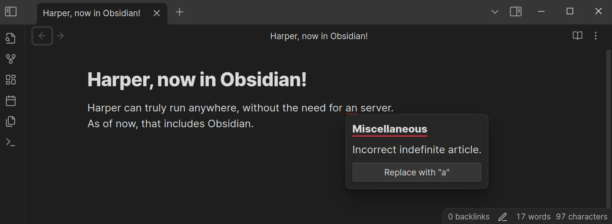

# `harper-obsidian-plugin`

[Harper](https://github.com/elijah-potter/harper) is a grammar checker for developers.
Starting today, it's the [grammar checker for everyone else, too](https://writewithharper.com/obsidian/).

Unlike other grammar checkers available for Obsidian, Harper runs entirely on your device, without any additional setup. Just enable it, and you get fantastic, private, and open source grammar checking, instantly.

## How to use it?

Harper runs quickly and on device.
It re-runs every time you make a modification to your documents.
If you see an error, just hover over it and Harper will suggest any changes it thinks you need.

## Where's all the code?

All of the code for the Harper Obsidian plugin lives [in the main Harper monorepo](https://github.com/elijah-potter/harper/tree/master/packages/obsidian-plugin).
This repository exists to satisfy the [requirements](https://docs.obsidian.md/Plugins/Releasing/Submit+your+plugin) laid out by the Obsidian team for their plugins.

## I have a problem or feature request...

Let me know if you have any problems, feature requests, or feedback of any kind by filling out an [issue on the main repository](https://github.com/elijah-potter/harper/issues/new).
